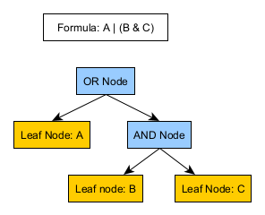
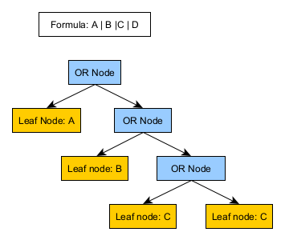
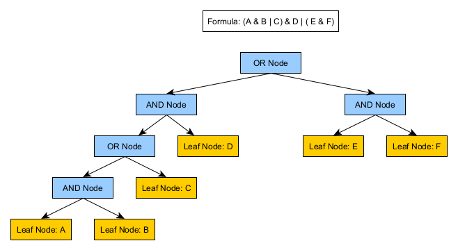
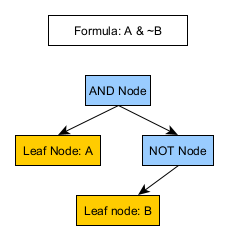
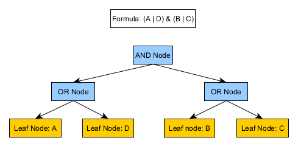
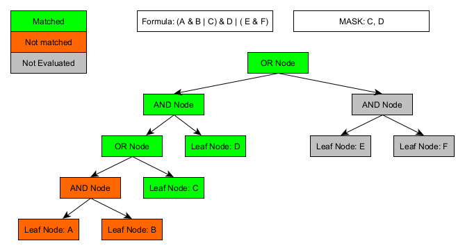
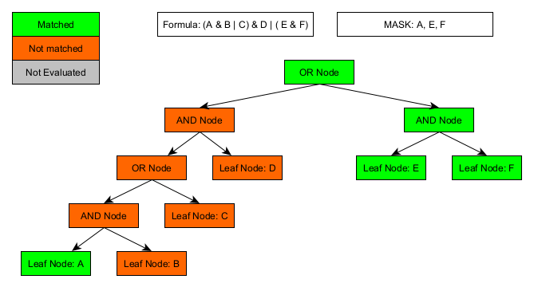
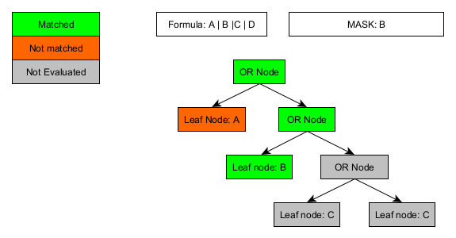
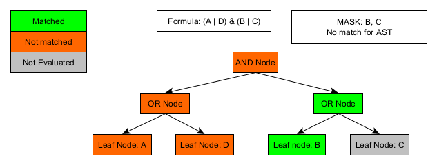

## Farser

Farser is a parsing library centered around DRG formulas created by HIS Clinical and Economic 
Research. A DRG formula can be thought of as a simple set of boolean logic that is applied to a 
"mask" (a list of string keys which evaluate to true when they exist or false when they not exist).

The library is further open to define your custom tokens and lex/parse any type of boolean formula.

There are two main components to Farser

  - The Lexer - creates tokens from a String representation of a (DRG) formula
  - The Descent Parser - creates an Abstract Syntax Tree of boolean logic from the lexer tokens
    - Can be used to evaluate the boolean formula and interact with the evaluation

----

#### Formula Lexer

The formula lexer simply splits a formula into well-defined elements (tokens). It recognizes 
specific token types (defined as enum constants) and has a catch-all type called `ATOM` for
everything else.

To implement your own tokens and lexer, see ["Implement your own Lexer"](implementYourOwnLexer.md).


##### Drg Formula Lexer

The main lexer is the `DrgFormulaLexer` - this lexer will convert an HIS DRG formula to a list 
of lexer tokens (see example below)

DRG Formula: `A | (~PFX:someValue & ~otherValue) & aFunction(param1, param2)`

Processing this as DRG formula

```java
    List<DrgLexerToken> lexed = DrgFormulaLexer.lex("... your formula ...");
```

will result in a list of `DrgLexerToken` with the following:

1. `DrgFormulaToken.ATOM`, value = "A"
2. `DrgFormulaToken.OR`, value = "|"
3. `DrgFormulaToken.LPAREN`, value = "("
4. `DrgFormulaToken.NOT`, value = "~"
5. `DrgFormulaToken.ATOM`, value = "someValue", prefix = "PFX"
6. `DrgFormulaToken.AND`, value = "&"
7. `DrgFormulaToken.NOT`, value = "~"
8. `DrgFormulaToken.ATOM`, value = "otherValue"
9. `DrgFormulaToken.RPAREN`, value = ")"
10. `DrgFormulaToken.AND`, value = "&"
11. `DrgFormulaToken.ATOM`, value = "aFunction"
12. `DrgFormulaToken.LPAREN`, value = "("
13. `DrgFormulaToken.ATOM`, value = "param1"
14. `DrgFormulaToken.COMMA`, value = ","
15. `DrgFormulaToken.ATOM`, value = "param2"
16. `DrgFormulaToken.RPAREN`, value = ")"

The lexer tokens on their own do not provide much utility, however combined with other logic can be
very useful. 

  - with the lexed tokens it is much easier to programmatically determine the
order of operations (or nesting of parentheses).
  - if you are uninterested in certain parts of the 
DRG formula you can ignore certain token types and only extract the information you are 
interested in.
  - you can save the tokens to a database rather than the DRG formula string, this enables 
    better, more advanced querying possibilities.
  - you can build an AST using the lexer tokens and "evaluate" the formula (See Descent Parser documentation below)  


All tokens are defined in `DrgFormulaToken`.

* **"("** - Left parenthesis
* **")"** - Right parenthesis
* **"&"** - Logical and
* **"|"** - Logical or
* **"~"** - Logical not
* **ATOM** - Anything that is not a token symbol from above

In addition to splitting a DRG formula into tokens, `DrgLexerToken` also supports a prefix for any ATOM tokens.
If it finds a string separated by a colon ":" it splits this into a value, and a
prefix (e.g. "PFX:val" is split into prefix "PFX" and value "val").

---

### The Descent Parser

The `DescentParser` can take an `Iterator` of type `DrgFormulaToken`s and build an Abstract 
Syntax Tree, which can then be used to "evaluate" the expression against a list of operands. The 
AST contains the **boolean** logic of the formula and can evaluate a given list of operands to see 
if the operands would evaluate to true or false.

For a generic implementation which can produce an AST of your custom token types, see `AstDescentParser`.

The purpose of the parser is not only to evaluate a formula (for which other approaches like 
[Apache Commons JEXL](https://commons.apache.org/proper/commons-jexl/reference/examples.html#Evaluating_Expressions) 
could be used), but also *to interact with the evaluation* during its processing operation. The 
"terminal nodes" (the ones where an evaluation has to happen) can be provided at AST construction 
time and can implement any necessary evaluation and/or inspection logic.


**Parser operator precedence:**

The operators in the following table are listed according to precedence order. The closer to the 
top of the table an operator appears, the higher its precedence.

| Operator           | DrgFormulaToken |
| ------------------ | --------------- |
| unary NOT          |  ~              |
| logical/binary AND |  &              |
| logical/binary OR  |  \|             |


**Evaluation order:** Formula evaluation happens from left to right. Only relevant portions of the 
formula will get evaluated (until a `true` result is achieved). See also: 
[Short-circuit evaluation](https://en.wikipedia.org/wiki/Short-circuit_evaluation).

Examples: 

 * `A & B | C` = `(A & B) | C` -> with `A=true`, `B=true`, `C=true`, it evaluates "A & B" only
 * `C | A & B` = `C | (A & B)` -> with `A=true`, `B=true`, `C=true`, it evaluates "C" only


#### Descent Parser Generic Type

The descent parser contains boolean logic that is applied to the operands of a formula, to be more 
flexible, the descent parser take a generic type argument for the type of operand. This is the type
that will be used in the terminal nodes to determine the outcome of the boolean logic. 

```Java
DescentParser<String> parser = new DescentParser<>(lexerTokens.listIterator(),
        new StringOperandSupplier(), suppliers);
```

The above will use `String` objects in the terminal nodes of the AST for the boolean logic 
evaluation.

```Java 
DescentParser<CustomTestOperand> parser = new DescentParser<>(lexerTokens.listIterator(),
        new CustomOperandSupplier(), customOperandSuppliers);
```

The above will use `CustomTestOperand` objects in the terminal nodes of the AST for the boolean 
logic evaluation.


#### Descent parser BooleanExpression

Terminal nodes are the nodes of the tree that do not have any children, in which case, a boolean 
expression must be evaluated and then return true or false. Farser provide a very simple 
`ContainsNode` which simple checks the that the provided operands contains a value. 

```Java
@Override
  public boolean evaluate(List<T> values, Set<T> accumulator) {
    boolean contains = values.contains(this.value);
    if (contains) {
      accumulator.add(value);
    }
    return contains;
  }
```

The above is rather simple and won't fit all use cases. In the event you need something more specific
you can implement the `BooleanExpression` interface and provide an implementation for the 
`evaluate` method.


#### Descent parser suppliers

The descent parser must be given the instructions for how to create terminal nodes. This is done
using *Java suppliers*. A default node supplier must be given to the Descent parser, in the absence of
specialty suppliers, the default supplier will be used to create a terminal node.

Speciality suppliers can be provided using a Map. When a terminal node is reached, the parser first
checks for a special supplier for the token, if one is found, it will use the special supplier to 
create the terminal node. This is how users can "supply" their own nodes to the parser. 

A supplier for the AST must adhere to the `NodeSupplier` interface and provide an implementation of 
the `BooleanExpression<R> createNode(T token);` method, where `T` is the token type and `R` is the
type of (context) object to be used in the terminal nodes `BooleanExpression` (must match the generic 
type of the DescentParser). Using this interface you can use _any_ object in the terminal nodes 
`BooleanExpression` of the AST for a given token type. 

```Java
private class StringOperandSupplier implements NodeSupplier<DrgLexerToken, String> {

    @Override
    public BooleanExpression<String> createNode(DrgLexerToken token) {
      return new ContainsNode<>(token.value);
    }
}
```

The above `NodeSuplier` creates a `BooleanExpression` of the concrete type `ContainsNode`. The 
contains node will simply evaluate where a certain String is present in the list that is passed 
to the `evaluate` method.

#### Descent Parser: Putting it all together

##### Create a custom NodeSupplier
```java
private class CustomOperandSupplier implements NodeSupplier<DrgLexerToken, CustomTestOperand> {

    @Override
    public BooleanExpression<CustomTestOperand> createNode(DrgLexerToken token) {
      return new ContainsNode<>(
          new CustomTestOperand(token.getValue(), token.getPrefix().orElse("NOT_NEEDED")));
    }
}
```

##### Create DescentParser using the custom Node supplier and create the AST
```java
    List<DrgLexerToken> lexerTokens = DrgFormulaLexer.lex("A | C");    
    DescentParser<CustomTestOperand> parser = new DescentParser<>(lexerTokens.listIterator(),
        new CustomOperandSupplier(), new HashMap<>());
    DrgSyntaxTree<CustomTestOperand> ast = parser.buildExpressionTree();
```


#### Evaluate a list of operands against the AST
```java
    List<CustomTestOperand> mask = Collections.singletonList(new CustomTestOperand("A", "NOT_NEEDED"));
    ExpressionResult<CustomTestOperand> evaluation = ast.evaluateExpression(mask);
```

#### Descent Parser ExpressionResult

The return type from `DrgSyntaxTree#evaluateExpression` is an `ExpressionResult`. This class has 
two methods

  - `isMatched` - whether the boolean logic in the AST was satisfied with the list of 
    operands provided
  - `getMatches` - the set of matched operands, which of the objects from the list of operands 
    were used to satisfy the boolean logic of the AST. 
    
Users can query the expression result after the AST has been evaluated.

When using custom tokens and/or custom a custom AST evaluation context object, the functionality may 
vary. The used context can get accessed with `ExpressionResult#getContext()`. The context may get 
updated during the evaluation to provide further information about the evaluation.


#### Abstract Syntax Tree Iteration

The `AbstractSyntaxTree` (and `DrgSyntaxTree`, plus any of the AST nodes) implement `Iterable`, 
which means that walking through the tree can be achieved by retrieving an iterator and calling 
`next` on it. The iteration follows the LTR (left-to-right) approach, the same as the 
evaluation of the formulas where the left-side nodes are visited/evaluated first. When each node 
is printed as text in iteration order, it produces a "Polish/prefix notation" form of the formula.

The used `LtrExpressionIterator` also implements "peeking" functionality to look at the next 
element with the `peek()` method without advancing the regular iteration. Additionally, the 
`LtrExpressionIterator` provides methods which return the current and peeked node "depth".

The formula `A & B | C` is iterated as `"OR" -> "AND"-> "A"-> "B"-> "C"`, which could be 
organized as a tree structure like this:

```text
OR
 |-AND
 |  |-A
 |  \-B
 \-C
```

Related code example:

```java
DescentParser<MaskedContext<String>> parser = ...;
AbstractSyntaxTree<MaskedContext<String>> ast = parser.buildTree();

LtrExpressionIterator<MaskedContext<String>> iter = ast.iterator();
while (iter.hasNext()) {
  String print = iter.next().print();
  System.out.println(print);
}
```


#### Abstract Syntax Tree Examples

The following diagrams are a visual representation of the AST after it was parsed by the descent parser.











#### Abstract Syntax Tree Evaluation Examples

The following diagrams are a visual representation of how the AST would be evaluated given the mask (list of operands).










#### Farser Maintainers

Creator: Mike Funaro </br> 
Core Contributors: Mike Funaro & Thomas Naeff
